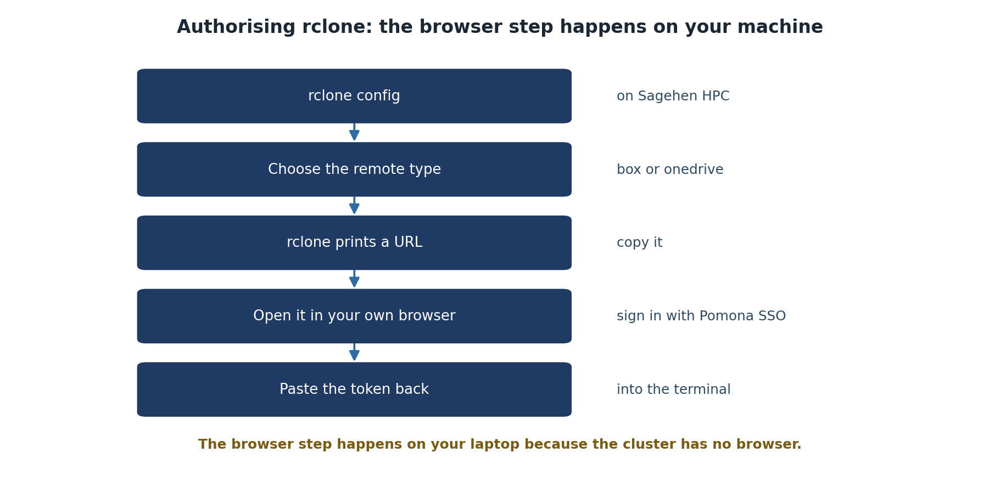

:::::::::::::::::::::::::::::::::::::: questions

- How do I load rclone on Sagehen HPC?
- What is SSH port forwarding and why do I need it?
- How does the rclone configuration process begin?

::::::::::::::::::::::::::::::::::::::::::::::

::::::::::::::::::::::::::::::::::::: objectives

- Connect to Sagehen with SSH port forwarding for OAuth
- Load the rclone module on the HPC cluster
- Understand the rclone configuration workflow

::::::::::::::::::::::::::::::::::::::::::::::

## Prerequisites

Before starting, make sure you have:

- SSH access to Sagehen HPC system
- A Pomona College NetID and either a Box or OneDrive account
- A terminal application (Terminal on Mac/Linux, PowerShell or Git Bash on Windows)
- A web browser for OAuth authentication
- Approximately 15 minutes

{alt='Five steps to authorise rclone. Run rclone config on Sagehen HPC, choose the remote type of box or onedrive, let rclone print a URL, open that URL in your own browser and sign in with Pomona single sign-on, then paste the token back into the terminal.'}

## Step 1: Connect to Sagehen HPC with Port Forwarding

::::::::::::::::::::::::::::::::::::: callout

## SSH Port Forwarding for Secure OAuth Authentication

The first step is to establish an SSH connection to Sagehen with port forwarding enabled. This creates a secure tunnel that rclone will use for OAuth authentication.

### Why Port Forwarding?

When you run `rclone config`, it starts a small web server locally on port 53682 to receive the OAuth token from Box or OneDrive. Your laptop and Sagehen need to communicate on this port securely, which is what SSH port forwarding does.

::::::::::::::::::::::::::::::::::::::::::::::

### For Mac/Linux Users:

Open your terminal and run:

```bash
ssh <myusername>@sagehen.hpc.pomona.edu -L 53682:localhost:53682
```

Replace `username` with your Pomona NetID (e.g., jsmith@sagehen.hpc.pomona.edu).

When prompted, enter your Pomona password.

**Expected output:**
```
Last login: Wed Mar 05 2026 13:45:02 -0700 from 192.168.1.100
[username@login-1 ~]$
```

### For Windows Users (PowerShell):

```powershell
ssh <myusername>@sagehen.hpc.pomona.edu -L 53682:localhost:53682
```

If SSH is not available, use PuTTY or Windows Subsystem for Linux (WSL).

### VS Code Remote SSH Users:

If you typically use VS Code's Remote-SSH extension, you can still use SSH with port forwarding by:

1. **Option A**: Use a separate terminal window (recommended for rclone setup)
2. **Option B**: Modify your `.ssh/config` to include the port forwarding:

```
Host sagehen
    HostName sagehen.hpc.pomona.edu
    User username
    LocalForward 53682 localhost:53682
```

Then connect with `ssh sagehen`.

You are now connected to Sagehen. The terminal prompt shows you're on the HPC system.

## Step 2: Load the rclone Module

Once connected to Sagehen, load the rclone module:

```bash
module load rclone
```

**Expected output:**
```
Loading rclone/1.65.2 ...
```

Verify rclone is available:

```bash
rclone version
```

**Expected output:**
```
rclone v1.65.2
- os/version: linux (Linux 6.8.0-94-generic #94-Ubuntu 22.04.1-generic)
- go version: go1.20.3
```

The version number may differ depending on the module version, but you should see rclone is ready to use.

## Step 3: Start rclone Configuration

Now you'll begin configuring rclone:

```bash
rclone config
```

**Expected output** (first run, no config yet — a short three-option menu):
```
NOTICE: Config file "/rhome/<myusername>/.config/rclone/rclone.conf" not found - using defaults
No remotes found, make a new one?
n) New remote
s) Set configuration password
q) Quit config
n/s/q>
```

Once you have remotes configured, the same command shows the longer
`e/n/d/r/c/s/u/m/v/b/q` menu with your remotes listed at the top.

{alt='Terminal on Sagehen showing module load rclone and rclone version reporting rclone v1.62.2 on Rocky Linux 8.10. Below, rclone config prints a notice that no config file exists yet and asks No remotes found, make a new one, with options n for new remote, s for set configuration password, and q to quit.'}

Type `n` to create a new remote. In the next episodes, you'll complete the configuration for Box or OneDrive.

## Saving Your Configuration

::::::::::::::::::::::::::::::::::::: callout

## Protecting Your rclone Configuration

rclone stores your configuration securely on Sagehen:

**Location**: `~/.config/rclone/rclone.conf`

This file contains your OAuth token and configuration. It's encrypted and should not be shared. Never commit this file to Git or upload it publicly.

::::::::::::::::::::::::::::::::::::::::::::::

::::::::::::::::::::::::::::::::::::: challenge

## Challenge 2.1: Connect and Load rclone

1. Open a terminal and connect to Sagehen with port forwarding:
   ```bash
   ssh <myusername>@sagehen.hpc.pomona.edu -L 53682:localhost:53682
   ```
2. Load the rclone module and verify the version:
   ```bash
   module load rclone
   rclone version
   ```

**Record**: What version of rclone is installed?

::::::::::::::::::::::::::::::::::::: solution

## Solution

After connecting and loading the module, `rclone version` should display something like:

```
rclone v1.65.2
- os/version: linux (Linux 6.8.0-94-generic #94-Ubuntu 22.04.1-generic)
- go version: go1.20.3
```

The exact version number may vary. Seeing any version output (no errors) confirms rclone is loaded and ready. If you get `rclone: command not found`, you forgot to run `module load rclone`.

::::::::::::::::::::::::::::::::::::::::::::::

::::::::::::::::::::::::::::::::::::::::::::::

::::::::::::::::::::::::::::::::::::: keypoints

- SSH port forwarding (-L 53682:localhost:53682) enables secure OAuth authentication between your browser and Sagehen
- The rclone module must be loaded with `module load rclone` before use on Sagehen
- rclone configuration is stored securely in ~/.config/rclone/rclone.conf and should never be shared
- The `rclone config` command starts an interactive setup wizard for adding cloud storage remotes

::::::::::::::::::::::::::::::::::::::::::::::

<!-- highlight <labname>/<myusername> placeholders in code blocks; remove if the varnish theme handles this natively -->
<script>(function(){var CSS='.sh-placeholder{color:#c2410c;font-weight:700}[data-bs-theme="dark"] .sh-placeholder,html.dark .sh-placeholder{color:#fdba74}@media (prefers-color-scheme: dark){[data-bs-theme="auto"] .sh-placeholder{color:#fdba74}}';var RX=/<labname>|<myusername>/g;function firstMatch(el){var w=document.createTreeWalker(el,NodeFilter.SHOW_TEXT,null),nodes=[],full='';while(w.nextNode()){nodes.push({n:w.currentNode,s:full.length});full+=w.currentNode.nodeValue;}RX.lastIndex=0;var m;while((m=RX.exec(full))){var s=m.index,e=s+m[0].length,inSpan=false,parts=[];for(var j=0;j<nodes.length;j++){var ns=nodes[j].s,ne=ns+nodes[j].n.nodeValue.length;if(ne<=s||ns>=e)continue;parts.push({node:nodes[j].n,a:Math.max(s-ns,0),b:Math.min(e-ns,nodes[j].n.nodeValue.length)});var p=nodes[j].n.parentNode;while(p&&p!==el){if(p.classList&&p.classList.contains('sh-placeholder')){inSpan=true;break;}p=p.parentNode;}}if(!inSpan&&parts.length)return parts;}return null;}function wrapParts(parts){for(var i=parts.length-1;i>=0;i--){var t=parts[i].node,txt=t.nodeValue,a=parts[i].a,b=parts[i].b;var span=document.createElement('span');span.className='sh-placeholder';span.textContent=txt.slice(a,b);var f=document.createDocumentFragment();if(a>0)f.appendChild(document.createTextNode(txt.slice(0,a)));f.appendChild(span);if(b<txt.length)f.appendChild(document.createTextNode(txt.slice(b)));t.parentNode.replaceChild(f,t);}}function run(){var st=document.createElement('style');st.textContent=CSS;document.head.appendChild(st);document.querySelectorAll('pre,code').forEach(function(el){var guard=0,parts;while((parts=firstMatch(el))&&guard++<500){wrapParts(parts);}});}if(document.readyState==='loading'){document.addEventListener('DOMContentLoaded',run);}else{run();}})();</script>
